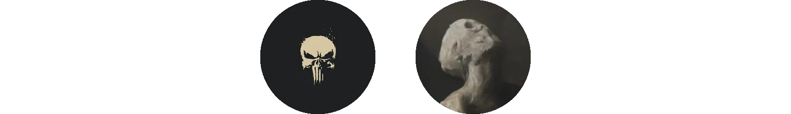

Omarchy insists that a computer should be as beautiful as it is productive. That premise has been carried by the theme makers and other Omarchy artists since day one. Building whole palettes, on their own time, for free, because they wanted their machine to look like something.

So we're starting [Omarchy AIR](/air/) — Artists in Residence — to support the best of them. A six-month residency for artists to work freely on themes, plugins, and whatever else they think Omarchy needs next. No roadmap, no tickets. The point is to let creativity flow with the support of the Omacom Foundation.

Each residency comes with $2,500 a month for the full six months, a token account so the agents never need to stop, and permanent recognition as AIR alumni once the six months are up.

There are up to three seats available at any one time, and two of them are now taken for this first season.

[HANCORE](https://github.com/HANCORE-linux) has two themes shipping with Omarchy — Solitude and Last Horizon — and another twenty on [the extras page](/themes/), more than anyone else has contributed: Batou, Oxo Carbon, Velvet Night, Rose of Dune, Shades of Jade, and it keeps going. He's a mechanical engineer who became one of the defining aesthetic forces in this community, sits on [Omarchy Core](/teams/), and helps steward [the plugin ecosystem](https://omarchyplugins.com/).

[OldJobobo](https://github.com/OldJobobo) is responsible for three of the themes that ship with Omarchy — Lumon, Miasma, and Retro 82 — plus another ten on the extras page, from Batman to City-783 to Sakura Mochi. He works in whole palettes rather than one-off colour schemes, which is why his themes hold together across the terminal, Neovim, btop, and the shell instead of only looking good in a screenshot.

The last seat is by invitation. The program begins in October.

I like Vitruvius' three requirements for good architecture: _firmitas, utilitas, venustas_. It must stand up, it must be useful, and it must be beautiful. Not two out of three. We will invest in all of it. We can fix everything.

