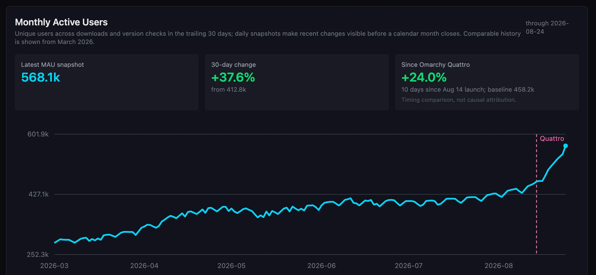

Third sponsorship out the door! The Omacom Foundation is becoming a premier sponsor of [mise](https://mise.jdx.dev/), and thereby of [jdx](https://x.com/jdxcode), who has spent years building the tool that quietly makes managing different versions of Ruby, Node, Go a joy to manage, and gives all your agent tooling in upgrade channel that can keep up with the pace of shipping.

If you've used Omarchy, you've used mise, whether or not you noticed. It's what manages the language runtimes, so `mise use -g ruby` gets you Ruby without a single line of PATH archaeology. But the part I care most about right now is the agents.

Every major coding-agent CLI in Omarchy ships as a lazy-loading mise stub in `~/.local/bin/`. Claude Code, Codex, OpenCode, Antigravity, Copilot, Crush, Grok, Pi, Oh My Pi — all sitting there, costing you nothing until the first time you actually type one. Then it installs itself and you're working. No package to hunt down, no version to pin, no toolchain to reason about. `omarchy-mise-install <package>` wraps any other CLI the same way, and `omarchy update` keeps every last one current.

That's the fast track. In _The Age of Agents_, the gap between hearing about a tool and running it needs to be about four seconds, and mise delivers that. Nobody had to package anything for a distro first.

The interest runs both ways, too: traffic to mise is up 24% since Omarchy launched! A lot of people are meeting this tool for the first time through us, which is exactly the kind of thing a sponsorship should recognize rather than take for granted.

Once again, special thanks to [Tobi Lütke](https://x.com/tobi), [Patrick Collison](https://x.com/patrickc), [Michael Dell](https://x.com/MichaelDell), [Jack Dorsey](https://x.com/jack), [Matthew Prince](https://x.com/eastdakota), [Brendan Iribe](https://x.com/brendaniribe), [Jason Fried](https://x.com/jasonfried), [Drew Houston](https://x.com/drewhouston), and [Peter Steinberger](https://x.com/steipete) for making this possible. If it wasn't for [Oligarchy](https://oligarchy.fyi), we wouldn't be able to fund open-source developers like this!

