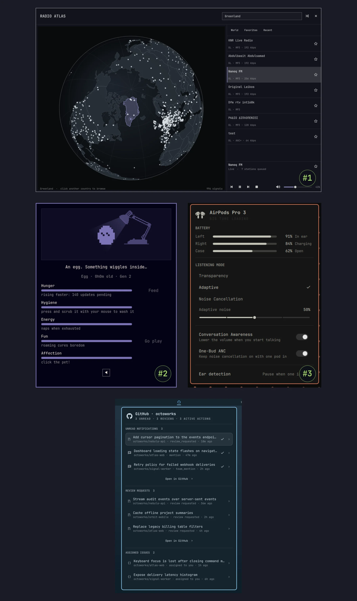

The votes are in! [Omarchy Core](/teams/) went through the submissions, voted, and we have a podium for [the first plugin competition](/news/2026/08/the-first-plugin-competition).

🥇 **First place: [Radio Atlas](https://omarchyplugins.com/plugin.html?id=akshar.radio-atlas) by Akshar Patel.** Spin a globe, land on a city, and listen to what they're listening to. It takes $2,500.

🥈 **Second place: [Omagotchi](https://omarchyplugins.com/plugin.html?id=slcode777.omagotchi) by [SLcode777](https://x.com/StellaSLcode).** A little creature that lives in your bar and needs you. Absolutely nobody needed this and everybody wants it. That's $1,000.

🥉 **Third place: [AirPods](https://omarchyplugins.com/plugin.html?id=io.github.thisisgm.omapods) by GM.** Battery levels and one-click switching for your AirPods, right in the bar. The kind of thing you only miss when you come from a Mac. $500 for that.

Honorable mention to [GitHub](https://omarchyplugins.com/plugin.html?id=robzolkos.github) by [Rob Zolkos](https://x.com/robzolkos), which puts your notifications and pull requests in the bar. No prize money, but a lot of votes!

Congratulations to all four, and thank you to everyone who submitted. Going through them was genuinely hard, which is the best possible problem to have.

And we're doing this again! More competitions, more prize money, more excuses to build something ridiculous for a Linux desktop. Watch this space.

